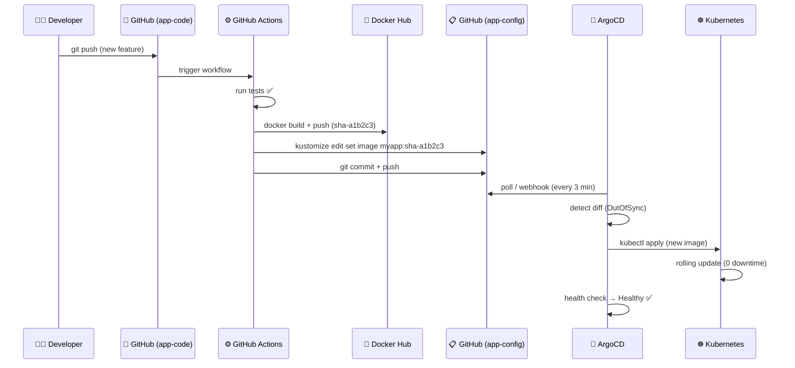

<div align="center">


<br/>
<br/>

# 🚀 Zero-Touch Deployments
## Production GitOps with ArgoCD, Kubernetes & GitHub

> **Git is the single source of truth. Push code → ArgoCD syncs production. Automatically. Always.**

<br/>

[](LICENSE)
[](CONTRIBUTING.md)
[](https://argocd.example.com)
[](https://github.com/org/myapp-config/stargazers)

</div>

---

## 📖 Table of Contents

- [✨ What is this?](#-what-is-this)
- [🏗️ Architecture](#️-architecture)
- [📂 Repository Structure](#-repository-structure)
- [⚙️ Tech Stack](#️-tech-stack)
- [🚦 GitOps Flow](#-gitops-flow)
- [🛠️ Prerequisites](#️-prerequisites)
- [⚡ Quick Start](#-quick-start)
- [📦 Kubernetes Manifests](#-kubernetes-manifests)
- [🤖 ArgoCD Setup](#-argocd-setup)
- [🔁 CI/CD Pipeline](#-cicd-pipeline)
- [🌿 Environment Strategy](#-environment-strategy)
- [🔄 Rollback Strategy](#-rollback-strategy)
- [🔐 Security & RBAC](#-security--rbac)
- [🐛 Troubleshooting](#-troubleshooting)
- [📊 Monitoring & Observability](#-monitoring--observability)
- [🤝 Contributing](#-contributing)

---

## ✨ What is this?

This project demonstrates a **production-grade GitOps pipeline** that gives you:

| Feature | What you get |
|---|---|
| 🔄 **Auto-sync** | Every Git commit to `main` deploys to production automatically |
| 🩹 **Self-healing** | ArgoCD detects drift and reverts manual cluster changes |
| 🕵️ **Full audit trail** | Every deploy is a Git commit — traceable, reviewable, reversible |
| ⏪ **1-command rollback** | `git revert HEAD && git push` — no special tools needed |
| 🔒 **Zero cluster access needed** | Developers never `kubectl exec` into production |
| 🌍 **Multi-environment** | Dev and prod share the same base manifests via Kustomize overlays |

---

## 🏗️ Architecture

```
┌─────────────┐    git push     ┌──────────────────────────────┐
│  Developer  │ ─────────────► │         GitHub               │
│             │                │  📁 app-code repo            │
└─────────────┘                │  📁 app-config repo (SSOT)   │
                               └──────────────┬───────────────┘
                                              │
                          ┌───────────────────┼───────────────────┐
                          │ GitHub Actions CI  │                   │
                          │                   ▼                   │
                          │  🐳 Build image   ┌───────────────┐   │
                          │  🏷️  Tag (git SHA) │ Docker Hub /  │   │
                          │  📤 Push image ──►│   Registry    │   │
                          │                   └───────────────┘   │
                          │  ✏️  Update kustomization.yaml         │
                          │  📝 Commit + Push to config repo      │
                          └───────────────────┬───────────────────┘
                                              │
                               polls / webhook│
                                              ▼
                               ┌─────────────────────────┐
                               │  🤖 ArgoCD Operator      │
                               │  • Detects Git diff      │
                               │  • Compares live state   │
                               │  • Auto-syncs if drift   │
                               └────────────┬────────────┘
                                            │ kubectl apply
                                            ▼
                          ┌─────────────────────────────────────┐
                          │   ☸️  Kubernetes Cluster (prod)      │
                          │                                     │
                          │  namespace: production              │
                          │  ┌──────────────┐  ┌───────────┐   │
                          │  │  Deployment  │  │  Service  │   │
                          │  │  3 replicas  │  │ ClusterIP │   │
                          │  └──────────────┘  └───────────┘   │
                          │  ┌─────────────────────────────┐   │
                          │  │  Ingress → app.example.com  │   │
                          │  └─────────────────────────────┘   │
                          └─────────────────────────────────────┘
```

---

## 📂 Repository Structure

This project uses the **two-repo strategy** — separating application code from deployment config:

### 📦 `app-code` repo — `github.com/org/myapp`

```
myapp/
├── 📄 Dockerfile
├── 📁 src/
│   ├── main.go
│   └── handler.go
└── 📁 .github/
    └── workflows/
        └── ci.yaml           # 🔁 CI: build → push → update config repo
```

### 🗂️ `app-config` repo — `github.com/org/myapp-config` ⭐ (this repo)

```
myapp-config/
├── 📁 base/                        # 🧱 Shared base manifests
│   ├── deployment.yaml
│   ├── service.yaml
│   ├── ingress.yaml
│   └── kustomization.yaml
│
├── 📁 overlays/
│   ├── 📁 dev/                     # 🧪 Dev environment (1 replica, debug logs)
│   │   ├── kustomization.yaml
│   │   └── patch-replicas.yaml
│   └── 📁 prod/                    # 🏭 Production (3 replicas, TLS, limits)
│       ├── kustomization.yaml      # ← CI updates image tag here
│       └── patch-resources.yaml
│
├── 📁 argocd/
│   ├── application.yaml            # 🤖 ArgoCD Application CRD
│   ├── app-of-apps.yaml            # 🌳 Root app (manages all apps)
│   └── project.yaml                # 🔐 ArgoCD Project + RBAC
│
└── 📄 README.md                    # 📖 You're reading this!
```

---

## ⚙️ Tech Stack

<div align="center">

| Layer | Technology | Purpose |
|---|---|---|
| 📋 **Source Control** |  | Single source of truth |
| 🤖 **GitOps Operator** |  | Continuous reconciliation |
| ☸️ **Orchestration** |  | Container orchestration |
| 🔁 **CI Pipeline** |  | Build, test, push |
| 🐳 **Container Registry** |  | Image storage |
| 🧩 **Config Management** |  | Overlay-based config |
| 🔒 **TLS** |  | Automatic HTTPS |
| 🌐 **Ingress** |  | Traffic routing |

</div>

---

## 🚦 GitOps Flow



---

## 🛠️ Prerequisites

Before you begin, make sure you have:

- ✅ A Kubernetes cluster (EKS / GKE / AKS / kind / k3s)
- ✅ `kubectl` configured with cluster access
- ✅ `helm` v3 installed
- ✅ `kustomize` installed
- ✅ Docker Hub account (or any container registry)
- ✅ GitHub account with two repos created
- ✅ `argocd` CLI installed

```bash
# Install ArgoCD CLI (macOS)
brew install argocd

# Install ArgoCD CLI (Linux)
curl -sSL -o argocd-linux-amd64 \
  https://github.com/argoproj/argo-cd/releases/latest/download/argocd-linux-amd64
chmod +x argocd-linux-amd64 && sudo mv argocd-linux-amd64 /usr/local/bin/argocd
```

---

## ⚡ Quick Start

### Step 1 — Install ArgoCD

```bash
# Create ArgoCD namespace
kubectl create namespace argocd

# Install ArgoCD (stable)
kubectl apply -n argocd \
  -f https://raw.githubusercontent.com/argoproj/argo-cd/stable/manifests/install.yaml

# Wait for all pods to be ready
kubectl wait --for=condition=Ready pods --all -n argocd --timeout=120s

# Get initial admin password
kubectl -n argocd get secret argocd-initial-admin-secret \
  -o jsonpath="{.data.password}" | base64 -d && echo
```

### Step 2 — Access the ArgoCD UI

```bash
# Port-forward locally
kubectl port-forward svc/argocd-server -n argocd 8080:443

# 🌐 Open https://localhost:8080
# Username: admin
# Password: (from Step 1)
```

### Step 3 — Login via CLI & register your config repo

```bash
# Login
argocd login localhost:8080 --username admin --password <YOUR_PASSWORD> --insecure

# Add the config repo (use a GitHub PAT)
argocd repo add https://github.com/org/myapp-config \
  --username git \
  --password ghp_yourpersonalaccesstoken
```

### Step 4 — Deploy the ArgoCD Application

```bash
# Create production namespace
kubectl create namespace production

# Apply the ArgoCD Application manifest
kubectl apply -f argocd/application.yaml

# Watch sync status
argocd app get myapp-production
argocd app list
```

### Step 5 — Verify deployment

```bash
# Check pods are running
kubectl get pods -n production

# Check ArgoCD sync + health
argocd app get myapp-production

# Expected output:
# Name:     myapp-production
# Status:   Synced
# Health:   Healthy
```

---

## 📦 Kubernetes Manifests

### `base/deployment.yaml`

```yaml
apiVersion: apps/v1
kind: Deployment
metadata:
  name: myapp
  namespace: production
spec:
  replicas: 1  # overridden by overlay
  selector:
    matchLabels:
      app: myapp
  template:
    metadata:
      labels:
        app: myapp
    spec:
      containers:
        - name: myapp
          image: myorg/myapp:latest  # replaced by kustomize
          ports:
            - containerPort: 8080
          resources:
            requests:
              cpu: "100m"
              memory: "128Mi"
            limits:
              cpu: "500m"
              memory: "256Mi"
          livenessProbe:
            httpGet:
              path: /healthz
              port: 8080
            initialDelaySeconds: 10
          readinessProbe:
            httpGet:
              path: /ready
              port: 8080
```

### `overlays/prod/kustomization.yaml`

```yaml
bases:
  - ../../base
images:
  - name: myorg/myapp
    newTag: sha-a1b2c3d  # ← CI bot updates this on every deploy
patches:
  - target:
      kind: Deployment
    patch: |
      - op: replace
        path: /spec/replicas
        value: 3
```

---

## 🤖 ArgoCD Setup

### `argocd/application.yaml`

```yaml
apiVersion: argoproj.io/v1alpha1
kind: Application
metadata:
  name: myapp-production
  namespace: argocd
  finalizers:
    - resources-finalizer.argocd.argoproj.io
spec:
  project: default
  source:
    repoURL: https://github.com/org/myapp-config
    targetRevision: HEAD
    path: overlays/prod
  destination:
    server: https://kubernetes.default.svc
    namespace: production
  syncPolicy:
    automated:
      prune: true       # delete resources removed from Git
      selfHeal: true    # revert any manual cluster changes
    syncOptions:
      - CreateNamespace=true
      - ApplyOutOfSyncOnly=true
    retry:
      limit: 5
      backoff:
        duration: 5s
        factor: 2
        maxDuration: 3m
```

> 💡 **Key flags explained:**
> - `selfHeal: true` → Git always wins. kubectl changes get reverted.
> - `prune: true` → Resources deleted from Git get deleted from cluster.
> - `CreateNamespace=true` → Namespace is auto-created if missing.

---

## 🔁 CI/CD Pipeline

### `.github/workflows/ci.yaml`

```yaml
name: CI → GitOps Deploy
on:
  push:
    branches: [main]

env:
  IMAGE: myorg/myapp
  CONFIG_REPO: org/myapp-config

jobs:
  build-and-deploy:
    runs-on: ubuntu-latest
    steps:
      - uses: actions/checkout@v4

      - name: Set image tag
        run: echo "TAG=sha-${GITHUB_SHA::7}" >> $GITHUB_ENV

      - name: Login to Docker Hub
        uses: docker/login-action@v3
        with:
          username: ${{ secrets.DOCKERHUB_USERNAME }}
          password: ${{ secrets.DOCKERHUB_TOKEN }}

      - name: Build & push image
        uses: docker/build-push-action@v5
        with:
          context: .
          push: true
          tags: ${{ env.IMAGE }}:${{ env.TAG }}

      - name: Update image tag in config repo
        run: |
          git clone https://x-token:${{ secrets.CONFIG_PAT }}@github.com/$CONFIG_REPO.git config
          cd config/overlays/prod
          kustomize edit set image myorg/myapp:${{ env.TAG }}
          git config user.email "ci-bot@github.com"
          git config user.name "CI Bot"
          git commit -am "ci: deploy myapp ${{ env.TAG }}"
          git push
```

> 🔑 **Required GitHub Secrets:**
> - `DOCKERHUB_USERNAME` — your Docker Hub username
> - `DOCKERHUB_TOKEN` — Docker Hub access token
> - `CONFIG_PAT` — GitHub PAT with write access to `app-config` repo

---

## 🌿 Environment Strategy

| Setting | 🧪 Dev | 🏭 Production |
|---|---|---|
| Replicas | 1 | 3 |
| CPU limit | 200m | 500m |
| Memory limit | 128Mi | 256Mi |
| TLS | ❌ | ✅ cert-manager |
| Auto-sync | ✅ | ✅ |
| selfHeal | ❌ | ✅ |
| Log level | DEBUG | INFO |
| HPA | ❌ | ✅ (3–10 pods) |

---

## 🔄 Rollback Strategy

GitOps makes rollbacks trivial — **no special tooling needed**.

```bash
# ✅ Option 1: Git revert (recommended — creates audit trail)
git revert HEAD --no-edit
git push
# ArgoCD detects the revert commit → auto-syncs old image back to prod

# ✅ Option 2: ArgoCD CLI rollback
argocd app history myapp-production      # list deployment history
argocd app rollback myapp-production 3  # rollback to revision 3

# ✅ Option 3: ArgoCD UI
# → open ArgoCD → myapp-production → History → select revision → Rollback
```

---

## 🔐 Security & RBAC

### ArgoCD AppProject

```yaml
apiVersion: argoproj.io/v1alpha1
kind: AppProject
metadata:
  name: production
  namespace: argocd
spec:
  sourceRepos:
    - https://github.com/org/myapp-config
  destinations:
    - namespace: production
      server: https://kubernetes.default.svc
  roles:
    - name: developers
      description: Read-only access for developers
      policies:
        - p, proj:production:developers, applications, get, production/*, allow
      groups:
        - org:developers
    - name: platform-team
      description: Full access for platform engineers
      policies:
        - p, proj:production:platform-team, applications, *, production/*, allow
      groups:
        - org:platform
```

### 🛡️ Security Best Practices Applied

- 🔒 No cluster credentials stored in app-code repo
- 🔑 Image pull secrets managed via Kubernetes secrets (not baked in)
- 📋 All changes go through Git (PR reviews before production)
- 🚫 Developers have **read-only** ArgoCD access (no direct kubectl to prod)
- 🔐 TLS everywhere — cert-manager auto-renews Let's Encrypt certs

---

## 🐛 Troubleshooting

<details>
<summary>❌ <strong>ComparisonError: failed to load live state</strong></summary>

**Cause:** ArgoCD can't reach the cluster API server.

```bash
argocd cluster list                  # check connection status
argocd cluster add <context-name>   # re-register the cluster
kubectl get secret -n argocd | grep cluster
```
</details>

<details>
<summary>❌ <strong>App stuck in OutOfSync after manual sync</strong></summary>

**Cause:** Resource in cluster has different labels/annotations than Git.

```bash
argocd app diff myapp-production         # see exact diff
argocd app sync myapp-production --force # force replace
kubectl describe <resource> -n production | grep -A5 Conditions
```
</details>

<details>
<summary>❌ <strong>ImagePullBackOff / 401 Unauthorized</strong></summary>

**Cause:** Missing or expired imagePullSecret for private registry.

```bash
kubectl create secret docker-registry regcred \
  --docker-server=https://index.docker.io/v1/ \
  --docker-username=USER \
  --docker-password=TOKEN \
  -n production
```

Then add to `deployment.yaml`:
```yaml
imagePullSecrets:
  - name: regcred
```
</details>

<details>
<summary>❌ <strong>ArgoCD keeps reverting my kubectl changes</strong></summary>

**This is working correctly!** `selfHeal: true` means Git always wins.

```bash
# ❌ WRONG — direct kubectl changes get reverted
kubectl set image deploy/myapp myapp=myorg/myapp:v2 -n production

# ✅ RIGHT — update Git, let ArgoCD sync
cd overlays/prod
kustomize edit set image myorg/myapp:v2
git commit -am "deploy: bump to v2" && git push
```
</details>

<details>
<summary>❌ <strong>Pods in CrashLoopBackOff after sync</strong></summary>

**Systematic debug flow:**

```bash
# 1. Check events
kubectl get events -n production --sort-by='.lastTimestamp' | tail -20

# 2. Check pod logs
kubectl logs -n production -l app=myapp --previous

# 3. Describe pods
kubectl describe pods -n production -l app=myapp

# 4. Check ArgoCD resource tree
argocd app resources myapp-production

# 5. Rollback via git revert
git revert HEAD --no-edit && git push
```
</details>

---

## 📊 Monitoring & Observability

| Tool | Purpose | Config |
|---|---|---|
| 🔭 **Prometheus** | Metrics scraping | `annotations: prometheus.io/scrape: "true"` |
| 📈 **Grafana** | Dashboards | ArgoCD metrics dashboard ID: `14584` |
| 🔔 **AlertManager** | PagerDuty/Slack alerts | Trigger on `argocd_app_info{sync_status="OutOfSync"}` |
| 📜 **Loki** | Log aggregation | Scrapes pods in `production` namespace |

```bash
# Key ArgoCD metrics to monitor
argocd_app_info                        # app health/sync status
argocd_app_sync_total                  # number of syncs
argocd_app_reconcile_duration_seconds  # reconciliation duration
```

---

## 🤝 Contributing

Contributions are welcome! Please follow the GitOps way:

1. 🍴 Fork this repo
2. 🌿 Create a feature branch: `git checkout -b feat/my-improvement`
3. ✏️ Make changes to manifests (never edit cluster directly!)
4. ✅ Test with `kubectl apply --dry-run=client`
5. 📤 Open a Pull Request
6. 🤖 ArgoCD will auto-deploy once merged to `main`

---

<div align="center">

**Made with ❤️ using GitOps principles**

⭐ Star this repo if it helped you | 🐛 [Report Issues](issues) | 💬 [Discussions](discussions)

<br/>


</div>
